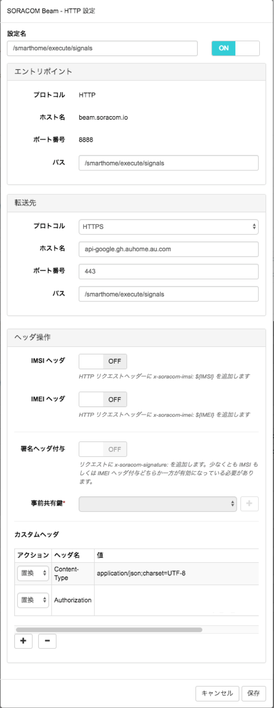

# IrRemocon-fan-guide
赤外線信号で扇風機を操作するサンプルコードのガイド

## 事前準備
赤外線信号で扇風機を操作する場合、事前準備として以下の設定が必要です。

### SORACOM Beam設定
SORACOM Beamについては、以下の設定を実施してください。

|設定項目|設定内容|
|------------------------|---------------------------------------------|
| エントリポイント-プロトコル | HTTP(SORACOM BeamのHTTPエントリポイントを選択) |
| エントリポイント-パス | /smarthome/execute/signals |
| 転送先-プロトコル | HTTPS |
| 転送先-ホスト名 | api-google.gh.auhome.au.com |
| 転送先-ポート番号 | 443 |
| 転送先-パス | /smarthome/execute/signals |
| カスタムヘッダ(1)-アクション | 置換 |
| カスタムヘッダ(1)-ヘッダ名 | Content-Type |
| カスタムヘッダ(1)-値 | application/json;charset=UTF-8 |
| カスタムヘッダ(2)-アクション | 置換 |
| カスタムヘッダ(2)-ヘッダ名 | Authorization |
| カスタムヘッダ(2)-値 | (ハッカソン当日に連携) |




## 扇風機の赤外線信号一覧
扇風機については、以下の赤外線信号送信による操作が可能です。扇風機操作は利用する赤外線リモコンにより、操作リクエストが異なります。


### KDGHACKS001のラベルが付与された赤外線リモコンを利用する場合

|操作|操作リクエスト|概要|
|---|------------|---|
| 電源 | 12270 | 電源のONとOFFの切替 |
| 風量変更 | 12271 | 風量の弱/中/強の切替 |


### KDGHACKS002のラベルが付与された赤外線リモコンを利用する場合

|操作|操作リクエスト|概要|
|---|------------|---|
| 電源 | 12272 | 電源のONとOFFの切替 |
| 風量変更 | 12273 | 風量の弱/中/強の切替 |


### 操作リクエストの指定について
操作リクエストについては、配列で複数指定することが可能です。赤外線信号については指定した順に送信されます。

```
[12270, 12271]
```
