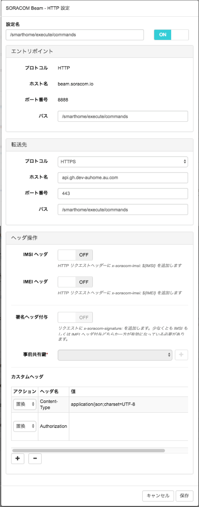

# IrRemocon-light-guide
赤外線信号で照明を操作するサンプルコードのガイド

## 事前準備
赤外線信号で照明を操作する場合、事前準備として以下の設定が必要です。

### SORACOM Beam設定
SORACOM Beamについては、以下の設定を実施してください。

|設定項目|設定内容|
|------------------------|---------------------------------------------|
| エントリポイント-プロトコル | HTTP(SORACOM BeamのHTTPエントリポイントを選択) |
| エントリポイント-パス | /smarthome/execute/commands |
| 転送先-プロトコル | HTTPS |
| 転送先-ホスト名 | api.gh.dev-auhome.au.com |
| 転送先-ポート番号 | 443 |
| 転送先-パス | /smarthome/execute/commands |
| カスタムヘッダ(1)-アクション | 置換 |
| カスタムヘッダ(1)-ヘッダ名 | Content-Type |
| カスタムヘッダ(1)-値 | application/json;charset=UTF-8 |
| カスタムヘッダ(2)-アクション | 置換 |
| カスタムヘッダ(2)-ヘッダ名 | Authorization |
| カスタムヘッダ(2)-値 | (ハッカソン当日に連携) |

## 照明の赤外線信号一覧
照明については、以下の赤外線信号送信による操作が可能です。

|操作|操作リクエスト|概要|
|---|------------|---|
| 照明電源ON | on | 照明電源をONにする |
| 照明電源ON | light_off | 照明電源をOFFにする |
