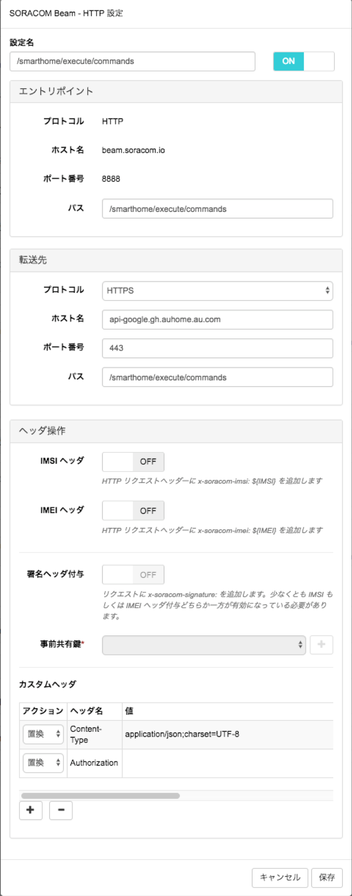

# IrRemocon-tv-guide
赤外線信号でテレビを操作するサンプルコードのガイド

## 事前準備
赤外線信号でテレビを操作する場合、事前準備として以下の設定が必要です。

### SORACOM Beam設定
SORACOM Beamについては、以下の設定を実施してください。

|設定項目|設定内容|
|------------------------|---------------------------------------------|
| エントリポイント-プロトコル | HTTP(SORACOM BeamのHTTPエントリポイントを選択) |
| エントリポイント-パス | /smarthome/execute/commands |
| 転送先-プロトコル | HTTPS |
| 転送先-ホスト名 | api.gh.dev-auhome.au.com |
| 転送先-ポート番号 | 443 |
| 転送先-パス | /smarthome/execute/commands |
| カスタムヘッダ(1)-アクション | 置換 |
| カスタムヘッダ(1)-ヘッダ名 | Content-Type |
| カスタムヘッダ(1)-値 | application/json;charset=UTF-8 |
| カスタムヘッダ(2)-アクション | 置換 |
| カスタムヘッダ(2)-ヘッダ名 | Authorization |
| カスタムヘッダ(2)-値 | (ハッカソン当日に連携) |

## テレビの赤外線信号一覧
テレビについては、以下の赤外線信号送信による操作が可能です。

|操作|操作リクエスト|概要|
|---|------------|---|
| 電源 | power | 電源のONとOFFの切替 |
| 音量アップ | vol_up | 音量を1上げる |
| 音量ダウン | vol_down | 音量を1下げる |
| 1チャンネル | ch1 | 1チャンネルに変更する |
| 2チャンネル | ch2 | 2チャンネルに変更する |
| 3チャンネル | ch3 | 3チャンネルに変更する |
| 4チャンネル | ch4 | 4チャンネルに変更する |
| 5チャンネル | ch5 | 5チャンネルに変更する |
| 6チャンネル | ch6 | 6チャンネルに変更する |
| 7チャンネル | ch7 | 7チャンネルに変更する |
| 8チャンネル | ch8 | 8チャンネルに変更する |
| 9チャンネル | ch9 | 9チャンネルに変更する |
| 10チャンネル | ch10 | 10チャンネルに変更する |
| 11チャンネル | ch11 | 11チャンネルに変更する |
| 12チャンネル | ch12 | 12チャンネルに変更する |
| BS切替 | bs | 入力をBSに変更する |
| CS切替 | cs | 入力をCSに変更する |
| カラーボタン緑 | green | カラーボタン緑を実行する |
| カラーボタン赤 | red | カラーボタン赤を実行する |
| カラーボタン青 | blue | カラーボタン青を実行する |
| カラーボタン黄 | yellow | カラーボタン黄を実行する |
| チャンネルアップ | ch_up | チャンネルを1順送りする |
| チャンネルダウン | ch_down | チャンネルを1逆送りする |
| メニュー | menu | メニューを表示する |
| 入力切替 | input | 入力切替を実行する |
| 地デジ切替 | digital | 地上デジタル放送に変更する |
| 戻る | back | 戻るボタンを実行する |
| 方向ボタン上 | arrow_up | 方向ボタン上を実行する |
| 方向ボタン下 | arrow_down | 方向ボタン下を実行する |
| 方向ボタン右 | arrow_right | 方向ボタン右を実行する |
| 方向ボタン左 | arrow_left | 方向ボタン左を実行する |
| 決定 | enter | 決定ボタンを実行する |
| 消音 | mute | 消音モード切替を実行する |
| 画面表示 | screen | 画面表示ボタンを実行する |
| 番組表 | schedule | 番組表ボタンを実行する |
| 音声切替 | audio | 音声切替ボタンを実行する |
| dボタン | d_button | dボタンを実行する |
