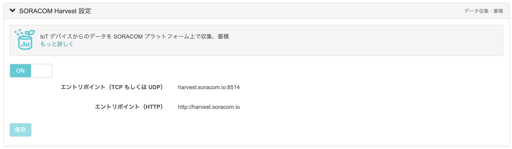

# SORACOM-lte-m-button-plus-guide
Soracom Harvestへの連携, Soracom Beamを利用しAWSと連携するための手順について説明します。

## 事前準備: グループに登録する
SORACOMコンソールへログインしてください。登録するには、DSN(DeviceSerialNumber)が必要となります。
DSNは LTE-M Button のリアカバーをあけ、確認してください。該当のSIMを所属させたいグループに紐づけてください。

## Harvest連携
Harvestへデータを送信するための手順です。

SIMを所属させたグループの設定を開き、Harvestの設定を有効にしてください。

手順は以上です。

あとは、ボタンを押すことでイベントを送信することができます。
また、付属の２本のワイヤを接触させることで、ボタンを押した場合と同じイベントを送信できます。
クリックのタイプにはSingle, Double, Longの３種類があり、Soracomコンソールで以下のように確認できます。

## Beam連携
BeamからAWS API Gateway経由でLambdaを実行するための手順です。
今回の例では、Lambdaでログ出力のみを行いますが、AWSの他のサービスを利用することで他にも様々な連携が可能になります。

[SORACOM Beam + Amazon API Gateway パターン](https://dev.soracom.io/jp/design_patterns/soracom_aws/#aws1)に従い、AWS API Gateway, AWS Lambdaの作成、Soracomグループの設定を行ってください。
